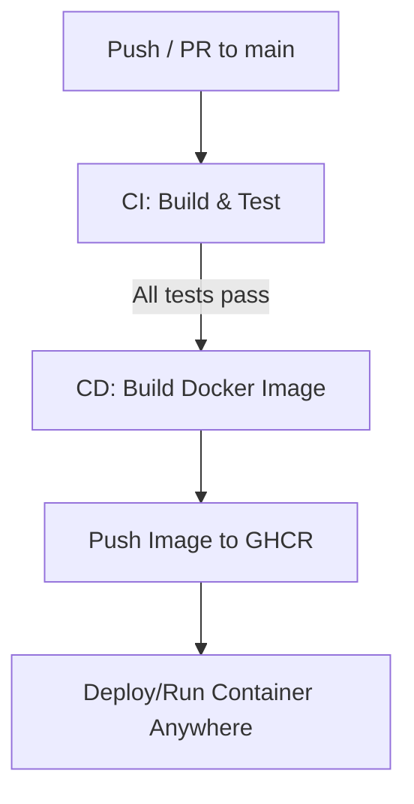

# 🏋️ ACEst Fitness & Gym

This project is a **Flask web application** for ACEst Fitness & Gym.
It demonstrates **Flask development, version control with Git/GitHub, automated testing with Pytest, containerization with Docker, and a CI/CD pipeline with GitHub Actions + GitHub Container Registry (GHCR)**.

It also includes a **realistic HTML landing page (index.html)** to make the app look like a professional gym website.

---

## 🚀 Features

* Flask web application with **gym management features**:

  * `/` → Realistic homepage (HTML UI with hero banner, sections, navigation)
  * `/members` → list of members
  * `/membership/<id>` → details of a specific member
  * `/workouts` → list of workout plans
  * `/trainers` → list of trainers
  * `/classes` → fitness class schedule
  * `/bmi?weight=70&height=1.75` → BMI calculator

* **JWT Authentication**:

  * `/login` → login with credentials to get JWT token
  * `/protected` → secured endpoint, requires valid token

* **Modern UI**:

  * Realistic landing page (`templates/index.html`) with sections for workouts, yoga, cardio
  * Navigation bar linking to API routes
  * Hero banner with call-to-action

* Unit tests with **Pytest** (positive + negative cases)

* Dockerized for portability

* GitHub Actions CI/CD pipeline:

  * Runs tests automatically
  * Builds & publishes Docker image to **GHCR**

---

## 📂 Project Structure

```
ACEst-Fitness/
│── app.py                 # Flask application
│── requirements.txt       # Dependencies
│── templates/
│    └── index.html        # Realistic Gym UI
│── tests/
│    ├── __init__.py
│    ├── test_app.py       # API tests
│    └── test_auth.py      # JWT tests
│── Dockerfile             # Containerization
│── .github/
│    └── workflows/
│        └── main.yml      # CI/CD pipeline
│── README.md              # Documentation
```

---

## ⚙️ Run Locally

### 1. Clone Repo

```bash
git clone https://github.com/kalyanimuppidi01/ACEest_Fitness-and-Gym.git
cd ACEst-Fitness
```

### 2. Virtual Environment

```bash
python3 -m venv venv
source venv/bin/activate
```

### 3. Install Dependencies

```bash
pip install -r requirements.txt
```

### 4. Run Flask App

```bash
python app.py
```

App runs at 👉 [http://localhost:5000](http://localhost:5000)
The homepage displays a **modern fitness landing page**.

---

## 🧪 Run Tests

```bash
pytest -v
```

Tests include:

* Members, workouts, trainers, classes
* Valid & invalid member lookup
* BMI calculator (valid & invalid inputs)
* JWT authentication (login success, login failure, protected access)

---

## 🐳 Run with Docker

### Build Image Locally

```bash
docker build -t aceest-fitness .
docker run -p 5000:5000 aceest-fitness
```

Open 👉 [http://localhost:5000](http://localhost:5000)

---

## 📦 Run from GitHub Container Registry (GHCR)

This repo is set up with **GitHub Actions** to automatically build and publish a Docker image.

### Pull the Latest Image

```bash
docker pull ghcr.io/kalyanimuppidi01/acest-fitness:latest
```

### Run the Container

```bash
docker run -p 5000:5000 ghcr.io/kalyanimuppidi01/acest-fitness:latest
```

---

## 🔐 JWT Authentication

### 1. Login to Get Token

```bash
curl -X POST http://localhost:5000/login \
     -H "Content-Type: application/json" \
     -d '{"username":"admin","password":"admin"}'
```

Response:

```json
{"access_token": "<your.jwt.token>"}
```

### 2. Access Protected Route

```bash
curl http://localhost:5000/protected \
     -H "Authorization: Bearer <your.jwt.token>"
```

Response:

```json
{"message": "Hello, admin. You are authorized!"}
```

---

## ⚡ CI/CD Pipeline (GitHub Actions)

This project uses **GitHub Actions** for automated CI/CD.

### 🔄 Workflow Overview

The pipeline (`.github/workflows/main.yml`) runs on every **push** and **pull request** to `main`.

It has two stages:

1. **Build & Test (CI)**

   * Checkout code
   * Set up Python 3.10
   * Install dependencies
   * Run all tests with `pytest`

2. **Docker Build & Push (CD)**

   * Runs only if tests pass
   * Logs into **GHCR** using a Personal Access Token (PAT)
   * Builds Docker image for the app
   * Pushes to GHCR as:

     ```
     ghcr.io/kalyanimuppidi01/acest-fitness:latest
     ```

---

### 📊 Pipeline Flow



---

### ✅ Benefits

* Ensures **code correctness** before packaging
* Guarantees **consistent container builds**
* Provides an **always-available Docker image** for deployment
* Secure authentication via **GitHub Actions secrets**

---
